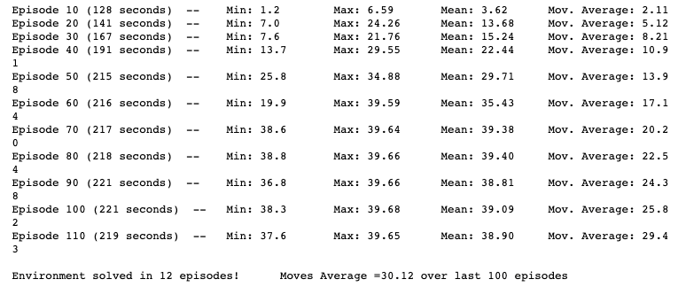
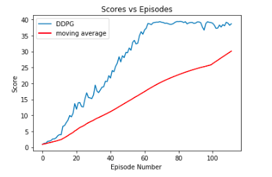

# Report Document
# Deep Reinforcement Learning Nanodegree
# Project 2: Continuous Control

### Project's Goal

For this project, I work with the [Reacher](https://github.com/Unity-Technologies/ml-agents/blob/master/docs/Learning-Environment-Examples.md#reacher) environment.

![Trained Agent][image1]

In this environment, a double-jointed arm can move to target locations. A reward of +0.1 is provided for each step that the agent's hand is in the goal location. Thus, the goal of your agent is to maintain its position at the target location for as many time steps as possible. The observation space consists of 33 variables corresponding to position, rotation, velocity, and angular velocities of the arm. Each action is a vector with four numbers, corresponding to torque applicable to two joints. Every entry in the action vector should be a number between -1 and 1. In order to solve the environment, I build a reinforcement learning (RL) agent that controls a robotic arm within Unity's Reacher environment that achieve a score of +30 averaged across all 20 agents for 100 consecutive episodes.


### Environment's Summary

Set-up: Double-jointed arm which can move to target locations.
Goal: Each agent must move its hand to the goal location, and keep it there.
Agents: The environment contains 20 agents linked to a single Brain.
Agent Reward Function (independent):
* +0.1 for each timestep agent's hand is in goal location.
Brains: One Brain with the following observation/action space.
* Vector Observation space: 33 variables corresponding to position, rotation, velocity, and angular velocities of the two arm Rigidbodies.
* Vector Action space: (Continuous) Each action is a vector with four numbers, corresponding to torque applicable to two joints. Every entry in the action vector should be a number between -1 and 1.
Visual Observations: None.
Reset Parameters: Two, corresponding to goal size, and goal movement speed.
Benchmark Mean Reward: 30

### Learning Algorithm
### Deep Deterministic Policy Gradient (DDPG)

In order to train the Agent and solve the environment I chose the **Deep Deterministic Policy Gradient (DDPG)** algorithm. As it's possible to read in the relative [paper](https://arxiv.org/pdf/1509.02971.pdf) presented by the Google Deepmind researchers, the DDPG is "a model-free, off-policy actor-critic algorithm using deep function approximators that can learn policies in high-dimensional, continuous action spaces.". I chose this algorithm due to the fact the problem to solve is a continuous action space. To best explore the situation, the algorithm leverages the Actor-Critic paradigm. While the actor model learns to predicts the actions, the critic model learns the state-action values to provide. As described below, to best achieve prediction results additional options have been introduced to the algorithm, such as Experience Reply, Ornsteing-Uhlenbeck Noise and so on. This is a continuous action space situation, so the DDPG algorithm is the best choice, leveraging the Actor-Critic paradigm. In continuous action spaces, exploration is done by adding noise to the action itself. Additional options have been introduced to the algorithm, such as Experience Reply, in the DDPG paper, the authors use Ornstein-Uhlenbeck Process to add noise to the action output (Uhlenbeck & Ornstein, 1930), in order to get better prediction results.

### Hyper Parameters
BUFFER_SIZE = int(1e6) # replay buffer size
BATCH_SIZE = 1024 # minibatch size
GAMMA = 0.99 # discount factor
TAU = 1e-3 # for soft update of target parameters
LR_ACTOR = 1e-3 # learning rate of the actor
LR_CRITIC = 1e-3 # learning rate of the critic before: 3e-4
WEIGHT_DECAY = 0.0000 # L2 weight decay
EPSILON = 1.0 # noise factor
EPSILON_DECAY = 1e-6 # decay of noise factor

### Actor-Critic Method

As described above, the DDPG algorithm uses a **Actor-Critic Method**. In detail, the replay buffer takes a series of experiences to update the weights of the critical model. In turn, the critical model will use this information to predict the actions of subsequent states given by the actor's model. In this way, by applying the Bellman equation the target values ​​are calculated, after having calculated the loss the model itself is updated trying to minimize it. In the meantime, the actor's model uses the output of the critical model to calculate its Q values ​​and current states to predict actions. Both models outputs are used to update the models. As mentioned in the paper linked above, the agent is given an Ornstein-Uhlenbeck trial in order to balance the continuous exploitation of space, Consequently to this process there is the addition of noise based on the parameters entered.


```
OU_SIGMA = 0.2          # Ornstein-Uhlenbeck noise parameter
OU_THETA = 0.15         # Ornstein-Uhlenbeck noise parameter
EPSILON = 1.0           # explore->exploit noise process added to act step
EPSILON_DECAY = 1e-6    # decay rate for noise process
```


Parameters used to split the agents' learning

```
LEARN_EVERY = 25        # learning timesteps
LEARN_NUM = 10          # learning passes
```

Parameters used for the agents learning model

```
BUFFER_SIZE = int(1e6)  # replay buffer size
BATCH_SIZE = 128        # minibatch size
GAMMA = 0.99            # discount factor
TAU = 1e-3              # for soft update of target parameters
LR_ACTOR = 1e-3         # learning rate of the actor
LR_CRITIC = 1e-3        # learning rate of the critic
WEIGHT_DECAY = 0        # L2 weight decay
LEARN_EVERY = 20        # learning timestep interval
LEARN_NUM = 10          # number of learning passes
OU_SIGMA = 0.2          # Ornstein-Uhlenbeck noise parameter
OU_THETA = 0.15         # Ornstein-Uhlenbeck noise parameter
EPSILON = 1.0           # explore->exploit noise process added to act step
EPSILON_DECAY = 1e-6    # decay rate for noise process
```

### Actor Learning Model

```
class Actor(nn.Module):
    """Actor (Policy) Model."""

    def __init__(self, state_size, action_size, seed, fc1_units=400, fc2_units=300):
        """Initialize parameters and build model.
        Params
        ======
            state_size (int): Dimension of each state
            action_size (int): Dimension of each action
            seed (int): Random seed
            fc1_units (int): Number of nodes in first hidden layer
            fc2_units (int): Number of nodes in second hidden layer
        """
        super(Actor, self).__init__()
        self.seed = torch.manual_seed(seed)

        self.fc1 = nn.Linear(state_size, fc1_units)
        self.bn1 = nn.BatchNorm1d(fc1_units)
        self.fc2 = nn.Linear(fc1_units, fc2_units)
        self.fc3 = nn.Linear(fc2_units, action_size)
        self.reset_parameters()

    def reset_parameters(self):
        self.fc1.weight.data.uniform_(*hidden_init(self.fc1))
        self.fc2.weight.data.uniform_(*hidden_init(self.fc2))
        self.fc3.weight.data.uniform_(-3e-3, 3e-3)

    def forward(self, state):
        """Build an actor (policy) network that maps states -> actions."""
        x = F.relu(self.bn1(self.fc1(state)))
        x = F.relu(self.fc2(x))
        return F.tanh(self.fc3(x))
```


### Experience Replay

```
class ReplayBuffer:
    """Fixed-size buffer to store experience tuples."""

    def __init__(self, action_size, buffer_size, batch_size, seed):
        """Initialize a ReplayBuffer object.
        Params
        ======
            buffer_size (int): maximum size of buffer
            batch_size (int): size of each training batch
        """
        self.action_size = action_size
        self.memory = deque(maxlen=buffer_size)  # internal memory (deque)
        self.batch_size = batch_size
        self.experience = namedtuple("Experience", field_names=["state", "action", "reward", "next_state", "done"])
        self.seed = random.seed(seed)

    def add(self, state, action, reward, next_state, done):
        """Add a new experience to memory."""
        e = self.experience(state, action, reward, next_state, done)
        self.memory.append(e)

    def sample(self):
        """Randomly sample a batch of experiences from memory."""
        experiences = random.sample(self.memory, k=self.batch_size)

        states = torch.from_numpy(np.vstack([e.state for e in experiences if e is not None])).float().to(device)
        actions = torch.from_numpy(np.vstack([e.action for e in experiences if e is not None])).float().to(device)
        rewards = torch.from_numpy(np.vstack([e.reward for e in experiences if e is not None])).float().to(device)
        next_states = torch.from_numpy(np.vstack([e.next_state for e in experiences if e is not None])).float().to(device)
        dones = torch.from_numpy(np.vstack([e.done for e in experiences if e is not None]).astype(np.uint8)).float().to(device)

        return (states, actions, rewards, next_states, dones)

    def __len__(self):
        """Return the current size of internal memory."""
        return len(self.memory)
```

### Results

Setting the parameters as described above, the environment is solved in 12 episodes. The agent is able to receive an average reward (over 100 episodes, and over all 20 agents) of at least +30 (30.12). The plot included below shows the final results:




To know more about how I solved the environment you can take a look at [Continuos_Control](https://github.com/elisaromondia/p2_continuous-control/blob/master/Continuous_Control.ipynb) Jupyter Notebook included in this repository.

### Future Improvements

A future idea to improve the agent's performance may can be implement other algorithms like the [Distributed Distributional Deterministic Policy Gradients (D4PG)](https://arxiv.org/abs/1804.08617), the [Trust Region Policy Optimization (TRPO)](https://arxiv.org/abs/1502.05477) or the [Proximal Policy Optimization (PPO)](https://openai.com/blog/openai-baselines-ppo/)
